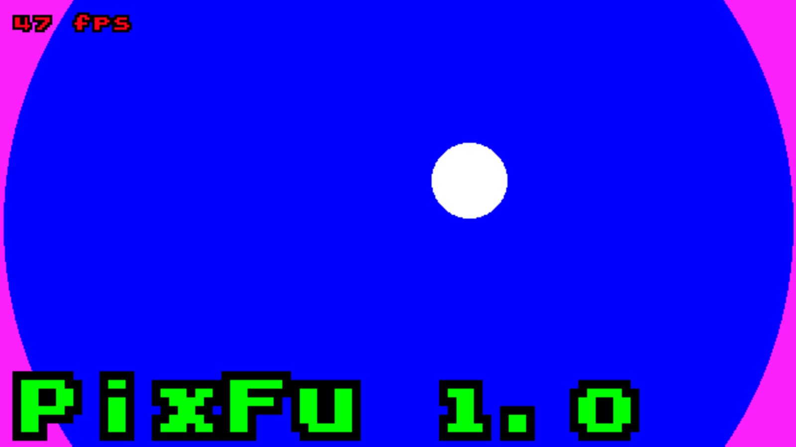
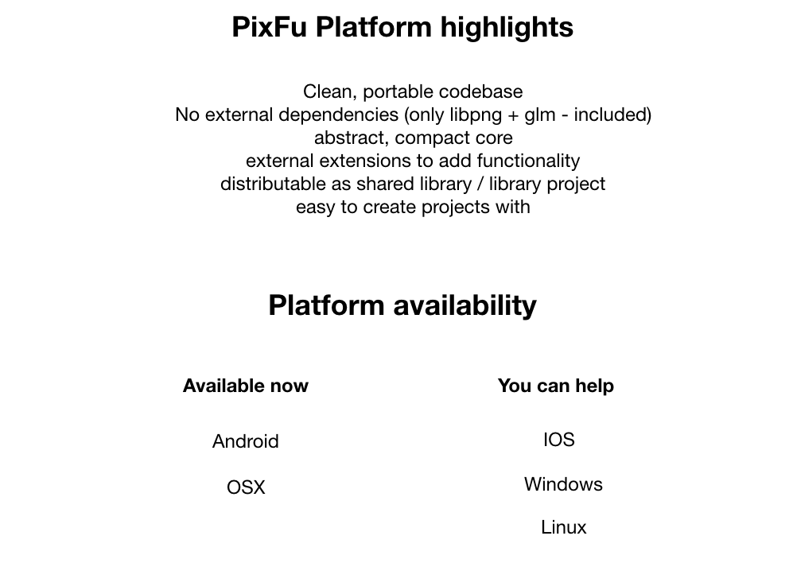
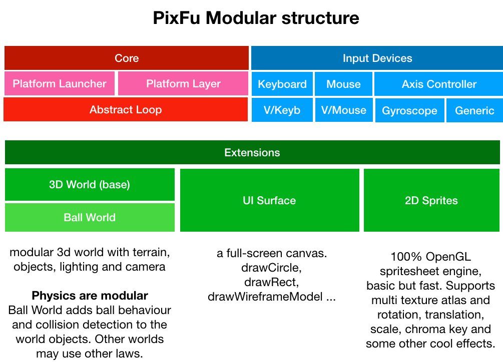
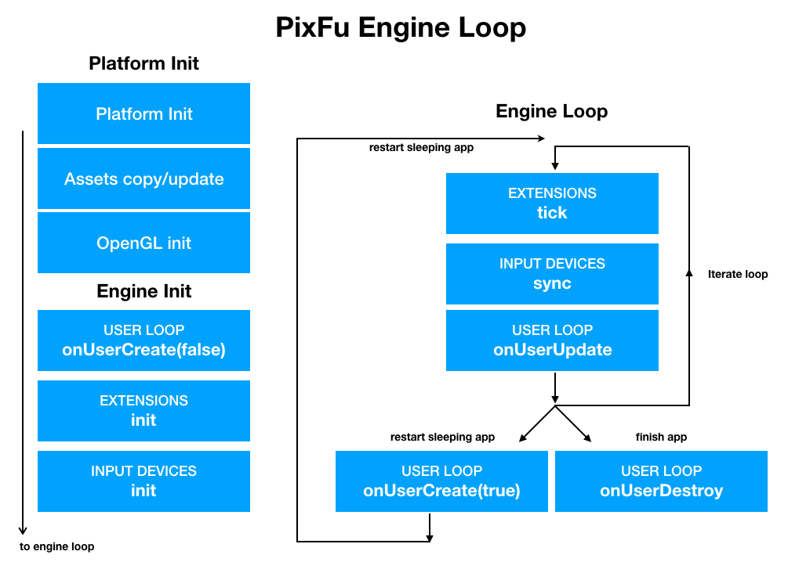
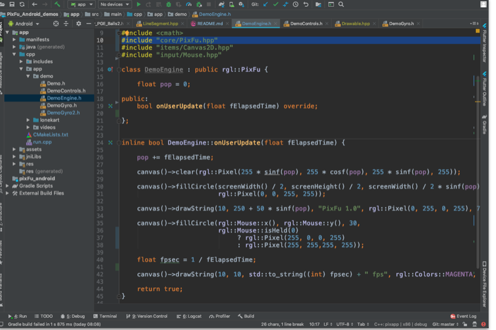
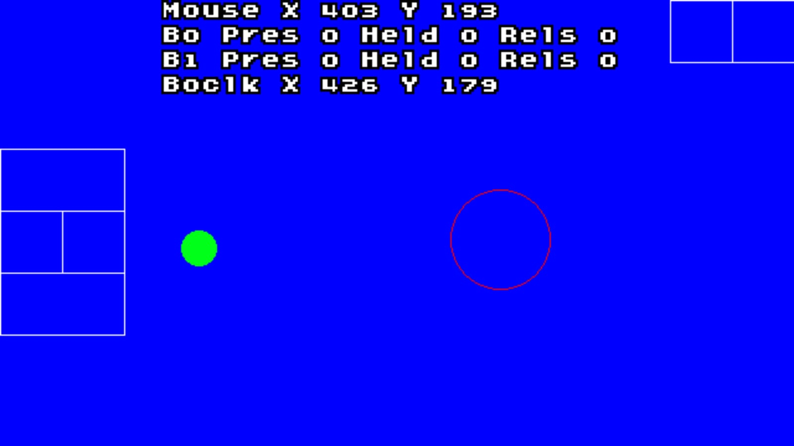
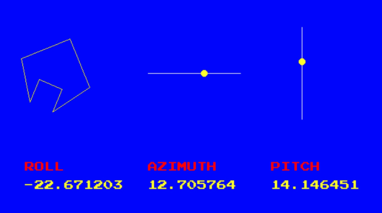
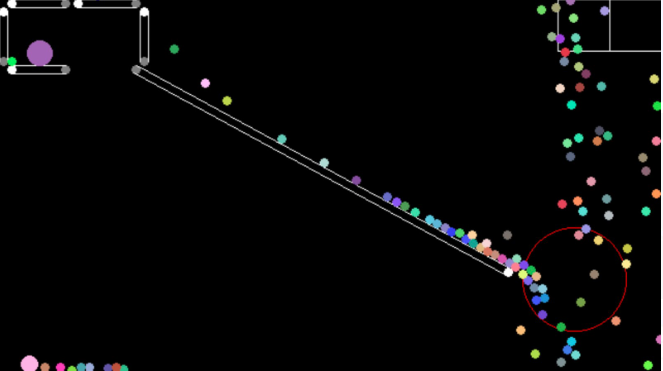

What is PixFu
=============

PixFu is a minimalistic modular game / realtime system engine. It is 100% written in C++ and OpenGL and runs on Desktop computers and Mobile devices (Android at the moment, IOS coming next).

PixFu core is based on famous engine OneLoneCoder Pixel Game Engine (http://onelonecoder.com) and has a redesigned full modular approach to allow optimizations for mobile devices and embedded platforms.

 Core: OpenGL initialization, platform abstraction, android/ios launchers

 Input Devices: Keyboard, Mouse, Virtual Mouse, Virtual Keyboard, Axis Controller, Gyroscope

 Extensions:

    - Primary Surface: provides a 2D canvas with functions to draw circles, lines, rectangles and multi-font strings. This extension is enabled by default. Source code for this extension comes from OLC PGE core. 
    
    - Sprites: OpenGL/powered sprites with scaling, rotation, fx and multi sprite atlas support

    - World: Complete minimalistic 3D world with terrain model, height maps, lighting, camera, and 3D-model object clusters with multi-texture support, optimized for mobile devices. 

Other Features:

    - OLC Pixel Game Engine compatibility layer, provides a base class that mimics the PGE Engine class. You can easily port your PGE modules to PixFu! (Note- Extensions are not supported, and not all functionality is emulated)

    - Includes GLM library, used internally, but also exported so it is ready to use in your project just including it. The library is compiled with FORCE_LEFT_HANDED, so angles are positive clockwise and physics behave as expected.
    
    - 100% modular structure allows to enable just the features you need. Even the primary UI surface is an extension that maybe you don't need to enable to get some fps!

PixFu Workflow
=============

PixFu provides a base Engine class that you will extend to your convenience. The base class abstracts all platfom details, and automatically manages extensions and input devices. 
Your code will be very tight without any extraneous background libraries or services !

How To Start
=============

This is a template Android Studio project that you can use to create your PixFu based applications.

It includes the PixFu/Android core as an AAR, and all build scripts and CMAKE configurations ready so you just can deploy one class, hit build and play the application in your phone.

Please refer to the root project PixFu https://github.com/nebular/PixFu_Android for technical details.

Pre-requisites
--------------

- Android Studio 3.5.2+ (lower may work)
- (not sure if you also need to install the NDK, easy anyways:  [NDK] (https://developer.android.com/ndk/) bundle.

Getting Started
---------------
1. Clone this project

`git clone https://github.com/nebular/PixFu_Android_demos.git
`
1. Open it in Android Studio

1. Press Play

Examples
--------------------------------------

- DemoControls: Mouse and Key events, with Virtual Mouse and Virtual Keybpard support

You can easily add virtual keys anywhere on the screen and build control clusters (look at the boxes near the top corners):

`		

        LoneScreenKey::currentInstance->add({olc::Key::W,    540,   0, 100, 50});

		LoneScreenKey::currentInstance->add({olc::Key::A,    540,  50,  50, 50});
		
		LoneScreenKey::currentInstance->add({olc::Key::D,    590,  50,  50, 50});
		
		LoneScreenKey::currentInstance->add({olc::Key::S,    540, 100, 100, 50});
`

 
- DemoGyro: gyroscope sensor can feed the AxisController Input Device and used like a joystick.

  

    - At the moment the gyroscope is "always on", that consumes a lot of battery, will add methods to start and stop.
    
- Balls: Example using OLC Pixel Game Engine Compatibility Layer, that provides a base class with the same interface as the original OLC/PGE and run examples from the popular YouTube channel. Note that extensions are not supported!

  

Start Developing
---------------
1. Place your application code in *app/src/main/cpp*
1. Place your application assets in *app/src/main/assets*
1. Instantiate your main class in the file *run.cpp*
1. Click *Run/Run 'app'*.

Support
-------
If you've found an error please [file an issue] (https://github.com/nebular/PixFu_Android/issues/new).

Patches are encouraged, and may be submitted by [forking this project](https://github.com/nebular/PixFu_Android/fork) and submitting a pull request through GitHub.

License
-------

https://creativecommons.org/licenses/by/4.0/
