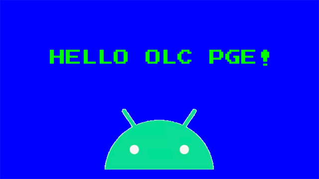
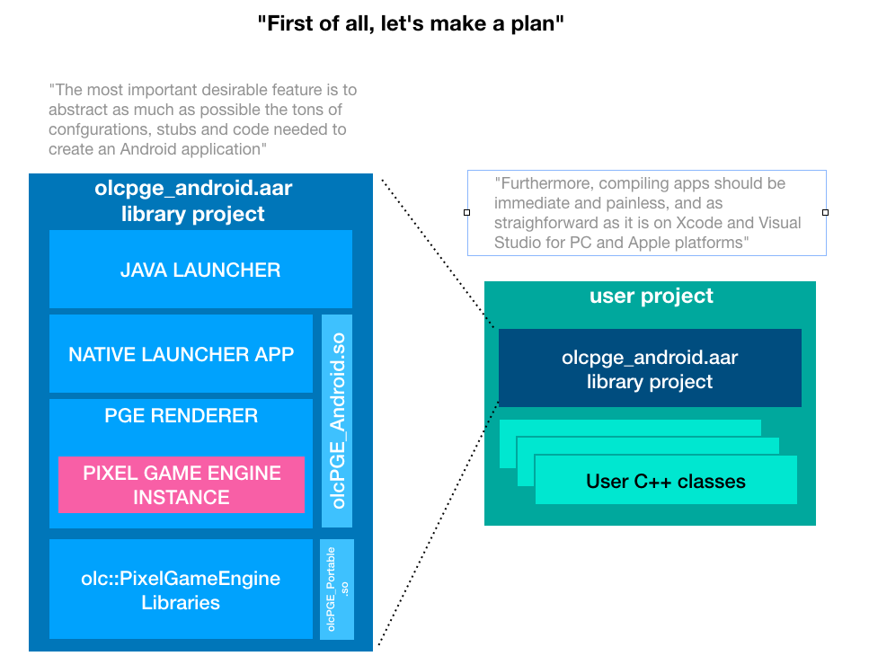
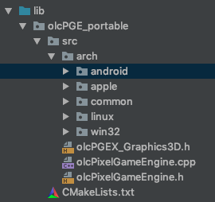

OLC/PixelGameEngine for Android 
===============================

So it's time to bring PGE into your pocket so you can play with it anywhere.

This was intended to be a 5 minute test, but as I faced lots of unexpected interesting challenges getting all the pieces to work I decided to do a "self-learning" project about the deep android internals.
I hope it is useful to you. Feel free to contribute, I would love this project to evolve. Funny thing about the PGE is, when you see it running on a phone, it just looks GORGEOUS. Beware you are going to get addicted to test every tutorial or app you have.

Regarding that, I will be porting the examples into the demo project.

ATTENTION
---------
This project is the source code of the Android port and support files of the OLC/Pixel Game Engine.
If you just are interested in creating stuff for PGE without diving into the technica stuff, maybe just
take a look to http://github.com/nebular/olcPGE_Android_demos.

The demo template project is all you need. You only need this project if you want to modify, update or customize  the internals.

Introduction
------------

So this project has several components:

1) olcPixelGameEngine-portable

This is like the original olcPixelGameEngine using also parts from the OSX port. You can see the modifications at 
http://github.com/nebular/olcPGE_portable. This fork moves arch-dependent code to separate folders
as platforms like Mac and Android need to include files and libraries alongside the .h. 

 

2) libpng

It has to be compiled for Android.

3) The launcher: An Android Activity with a GLES/3 Native Window, and Java support files to inirialize it.
   Also takes care of unpacking the assets into the filesystem, and manages accelerometer and touch, that are injected into the PGE as Mouse and Joystick values.

4) The Main Native App: The native twin of the above, connected by a JNI bridge.  The Main native 
app implements the native OpenGL loop. It is here where we interface the PGE, for exmaple Android 
will request an OpenGL step, that we forward to the PGE.

All these four components are built as shared .so libraries

5) The CMAKE and Gradle compile and build scripts. This has been the most complex part of the project, as we are releasing all this into a cool AAR
module that you just insert into your project and all will just work.

There were several inconveniences to solve, mostly derived from splitting in two projects, and the fact that Android CMAKE toolchains and library projects are still very unconnected worlds. 
The root of the problem  is that everything is designed so a main Java app can consume CMAKE native apps AND library projects, but not that a library
project would be used to feed a user CMAKE without any Java (exactly our case). As CMAKE runs before the library project merging, we had to find a way
to pack what the user CMAKE needs in the AAR, and then unpack everything into the User CMAKE before the build starts. Also, to make development easier on the user side,
we needed to unpack the collected header files and make them available automatically, so the user don't need to install any headeers or anything
other than her CPP classes. 

So thanks to countless StackOverflow tricks, these things are implemented in the CMakeLists and gradle scripts and everything should work
out of the box. You will be able to create a PGE app as quick as @javidx9 does with Visual Studio !

Tricks in the scripts:
- The AAR is used in three different ways: as an imported AAR Library Module, as a communication channel between the user project and the precompiled root project, and as a flat repository with Java Classes.
* User CMAKE links with so's and headers packed into, and unpacked from, the AAR
* Headers are populated into userspace automatically
* The "flat repository mode",  is the magic sauce that allows to declare the AAR as a compile dependency, propagating the activity launcher in the AAR to the user project automatically.

Pre-requisites
--------------
- Android Studio 3.5.2+ (lower may work)
- [NDK] (https://developer.android.com/ndk/) bundle.

Getting Started
---------------
1. Clone this project

`git clone https://github.com/nebular/olcPGE_Android.git
`
1. Open it in Android Studio

1. You can modify or add stuff to the launcher Java or Native side
 
 When you want to create the AAR, after building it, just type on the terminal, on the project root:
 
 `./gradlew copyAAR`
 
 and the AAR will be generated and copies into /releases/
  
 Then in your user projects, just replace the existing AAR with this new one.
 
 It is important that the name is the same. One file should replace the other.
 
 Then just Play the project, don't even need to rebuild it. Gradle will detect the updated AAR and generate the updated headers.

To be continued

Support
-------

Please [file an issue] or suggestion at (https://github.com/nebular/olcPGE_Android/issues/new).

Patches are encouraged, and may be submitted by [forking this project](https://github.com/nebular/olcPGE_Android/fork) and submitting a pull request through GitHub.

License
-------

https://creativecommons.org/licenses/by/4.0/
